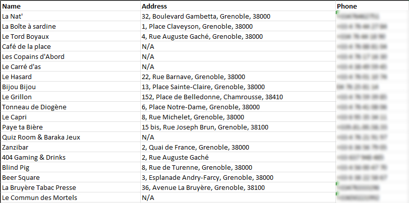

# OpenStreetMap Business Scraper

This is a **PHP web application** that fetches business data from OpenStreetMap using the Overpass API. The application allows you to input geographical coordinates, radius, and business categories, then retrieves relevant data such as name, address, and phone number. The fetched data can be saved to an Excel file, and duplicate entries can be removed.

## Features

- **Input Location Details:**
  - Enter latitude, longitude, and search radius (in kilometers)
  - Use the interactive map to select coordinates visually
- **Select Business Categories:**
  - Choose from a predefined list of categories (e.g., restaurants, banks, shops)
  - Organized categories in a grid format for easy selection
  - "Check All" and "Uncheck All" buttons for convenient selection
- **Data Retrieval and Processing:**
  - Fetch business data based on selected categories
  - Exclude businesses without a phone number with a simple checkbox
  - Remove duplicate business names from the results
- **Data Export:**
  - Save the results in an Excel file with a timestamped filename (`Fetched_Businesses_YYYY-MM-DD_HH-MM-SS.xlsx`)
  - The file is automatically deleted from the server after download
- **User Interface Enhancements:**
  - Responsive design suitable for desktop and mobile devices
  - Loading indicators during data fetching
  - Data persistence between actions (inputs are retained)
  - Clickable links to the developer's website and GitHub repository
 
Try it on my website : https://clement.business/OSM-Business-Scraper

## Requirements

- **Web Server** with PHP support (e.g., Apache with PHP, WAMP, XAMPP)
- **PHP 7.0 or higher**

**Note:** All necessary Composer dependencies and libraries are included within the project in the `vendor` directory. You do not need to run `composer install` separately.

## Installation

1. **Download the Project:**

   - Download this project from the repository.
   - Extract the folder.

2. **Place the Project in Your Web Server's Root Directory:**

   - Move the `OSM-Business-Scraper` folder to the root of your web server's `www` directory.
     - For **WAMP**, place it in `C:\wamp64\www\OSM-Business-Scraper`.
     - For **XAMPP**, place it in `C:\xampp\htdocs\OSM-Business-Scraper`.

3. **Access the Application:**

   - Start your web server (e.g., WAMP, XAMPP).
   - Open your web browser and navigate to:
     - `http://localhost/OSM-Business-Scraper/index.php`

## Usage

1. **Enter Location Details:**

   - Input the latitude and longitude of the area you want to search.
   - Enter the search radius in kilometers.

2. **Select Location on Map (Optional):**

   - Click the **Select Location on Map** button to open an interactive map.
   - Click on the desired location on the map. The latitude and longitude fields will be automatically updated.

3. **Select Business Categories:**

   - Choose the business categories you want to include by checking the boxes.
   - Use the **Check All** or **Uncheck All** buttons for convenient selection.

4. **Exclude Entries Without Phone Number (Optional):**

   - Check the **Exclude entries without phone number** option if you only want businesses with a phone number.

5. **Fetch Businesses:**

   - Click the **Fetch Businesses** button to retrieve data from OpenStreetMap.
   - A loading message will appear while data is being fetched.

6. **Remove Duplicate Names (Optional):**

   - Click the **Remove Duplicate Names** button to eliminate duplicate entries based on business names.

7. **Save Data:**

   - Click the **Save Data** button to save the results in an Excel file.
   - The file will be named `Fetched_Businesses_YYYY-MM-DD_HH-MM-SS.xlsx` and will be downloaded to your computer.
   - The file is temporarily stored on the server and will be deleted after download.

8. **Additional Resources:**

   - Click the **GitHub Repository** link to access the project repository.
   - Click **Made by Clément GHANEME** to visit the developer's website.

## Composer and Dependencies

The project uses Composer for dependency management, specifically for the PhpSpreadsheet library required for Excel file generation. **All necessary Composer files and libraries are included in the project within the `vendor` directory.** Therefore, you do not need to run `composer install` separately.

**Included Composer Files:**

- `composer.json` and `composer.lock`
- `vendor/` directory containing all dependencies and autoload scripts

**Note:** If you update dependencies or wish to install the project without the included `vendor` directory, you will need to have Composer installed and run `composer install` in the project's root directory.

## Screenshots

## Notes

- **Data Source:** Data is fetched from [OpenStreetMap](https://www.openstreetmap.org/) using the Overpass API.
- **Session Management:** The application uses PHP sessions to store data between requests.
- **File Deletion:** The Excel file generated is temporarily stored on the server and is deleted immediately after the user downloads it for security and storage efficiency.
- **Error Handling:** Basic error handling is implemented, but ensure all user inputs are valid to prevent unexpected behavior.

## Changelog

- **2024/10/21** - Initial release (Python version).
- **2024/11/05** - Converted application to PHP for web-based usage.
  - Integrated Composer dependencies within the project.
  - Improved user interface with responsive design.
  - Added features: timestamped filenames, loading indicators, and data persistence.
- **2024/11/06** - Updated README and project structure for easy deployment.
  - Included all Composer files and libraries within the project.
  - Adjusted installation instructions accordingly.
- **2024/11/06** - Added cooldown feature for each unique public ip ; improved gui.

## Acknowledgments

- Data fetched from [OpenStreetMap](https://www.openstreetmap.org/)
- Overpass API for querying OpenStreetMap data
- [PhpSpreadsheet](https://github.com/PHPOffice/PhpSpreadsheet) library for Excel file generation

---

Clément GHANEME - 2024/11
