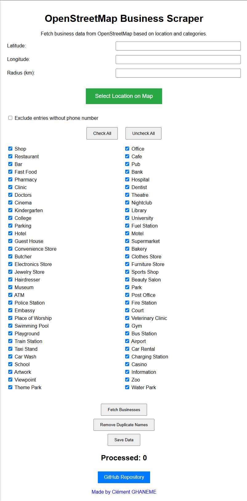

# OpenStreetMap Business Scraper

This is a Python application that fetches business data from OpenStreetMap using the Overpass API. The application allows you to input geographical coordinates, radius, and business categories, then retrieves relevant data such as name, address, and phone number. The fetched data can be saved to an Excel file, and duplicate entries can be removed.

## Features
- Input latitude, longitude, and search radius (in kilometers)
- Select business categories from a predefined list (e.g., restaurants, banks, shops)
- Display categories in an organized grid format for easy selection
- Centered "Check All" and "Uncheck All" buttons for user convenience
- Fetch business data based on the selected categories
- Exclude businesses without a phone number with a simple checkbox
- Remove duplicate business names
- Save the results in an Excel file (`businesses.xlsx`)
- Interactive map integration for selecting location coordinates
- Clickable link to the developer's website and a GitHub repository button
- Fixed-size GUI for a consistent user experience

## Requirements
The app requires the following Python modules:
- `requests`
- `tkinter`
- `openpyxl`
- `tkintermapview`

If the modules are not installed, the app will automatically install them.

## Installation
1. Clone the repository or download the script.
2. Run the script, and it will check for required modules and install them if missing.

## Usage
1. Enter the latitude, longitude, and search radius.
2. Use the interactive map button to select location coordinates if needed.
3. Select the business categories you want to include from the grid layout.
4. Click `Check All` or `Uncheck All` for convenient category selection.
5. Click `Fetch Businesses` to retrieve the data from OpenStreetMap.
6. Click `Remove Duplicate Names` to remove any duplicate businesses from the results.
7. Check the `Exclude entries without phone number` option if needed.
8. Click `Save Data` to save the results in an Excel file.
9. Use the GitHub button to access the project repository or the developer link to visit the website.

## Acknowledgments
- Data fetched from [OpenStreetMap](https://www.openstreetmap.org/)
- Overpass API for querying OpenStreetMap data

## Screenshot - Application GUI

## Changelog

- 2024/10/21 - Initial release.
- 2024/10/21 - Added "osm_business_scraper_advanced.py" for advanced filter handling in API requests.
- 2024/11/04 - Enhanced GUI with fixed window size (645x888), organized category grid, added interactive map feature, added GitHub repository button, added website link.

Clément GHANEME - 2024/11
